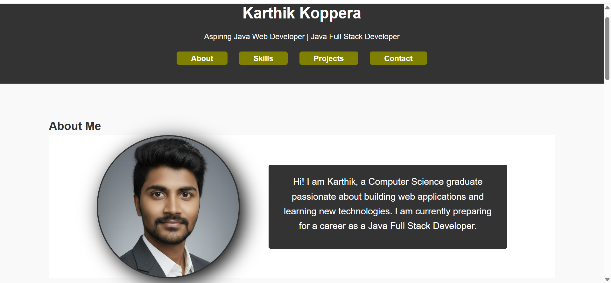

# 🌐 My Portfolio Website

This is my personal portfolio website built using **HTML & CSS**.  
It showcases my skills, projects, and resume in a simple and responsive design.

---

## 🚀 Features

- About Me section with profile photo
- Skills and technologies
- Projects with live/demo links
- Resume download option
- Contact section with social links & icons

---

## 📂 Project Structure

```
portfolio/
│── index.html
│── style.css
│── images
│── Koppera_Karthik_Resume.pdf
│── README.md
```

---

## 🛠️ Technologies Used

- HTML5
- CSS3 (Flexbox & Responsive Design)
- FontAwesome / FlatIcons (for icons)

---

## 📸 Preview



---

## 🔗 Live Demo

👉 [View My Portfolio](https://karthik-koppera.github.io/my-portfolio/)

---

## 📬 Contact

- 📧 Email: karthikkoppera7@gmail.com
- 🔗 LinkedIn: [Karthik Koppera](https://www.linkedin.com/in/karthik-koppera-2440b22ab/)
- 🐙 GitHub: [Karthik Koppera](https://github.com/Karthik-Koppera)
